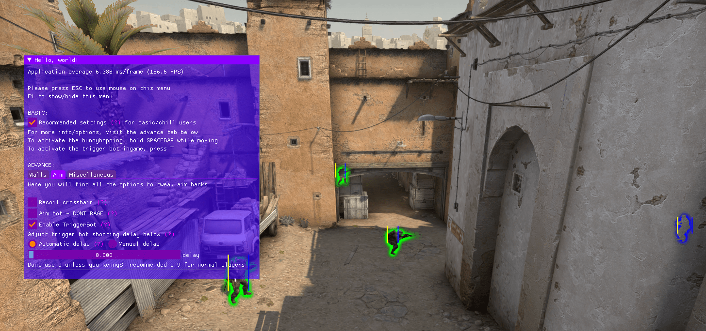

# CSGO Hacks: Aimbot, Wall hacks and more
I am publishing the CSGO hacks that i wrote last year(2020). These bypass *Valve Anti Cheat* which used userland hooks. It is primarily written in C++.

## Features
1. all kinds of wall (esp, 2d, 3d, glow, status 2d, snap lines, etc. available as options)
2. Trigger bot, with weapon checks, custom delay and all
3. misc is basically simple no flash, bhop, headline, radar hack etc.
4. Light weight UI using IMGUI and directx9
5. The code base doesnt call any api hooked by VALVE ANTI CHEAT and circumvents userland hooks. The code generates a dll that can be injected into csgo.exe using your favourite DLL injector.

## I will not compile, give releases or any other kind of support. This was written as part of my learning and not for commercial purposes. 

wanna test it?
change the offsets and compile.
